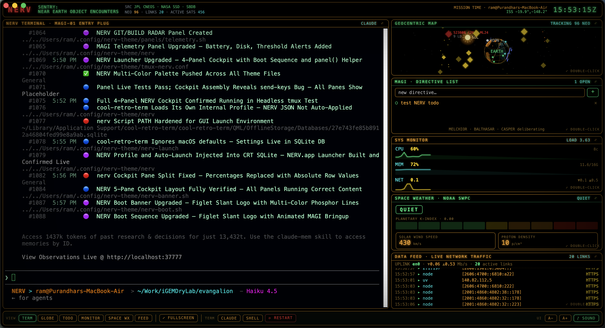
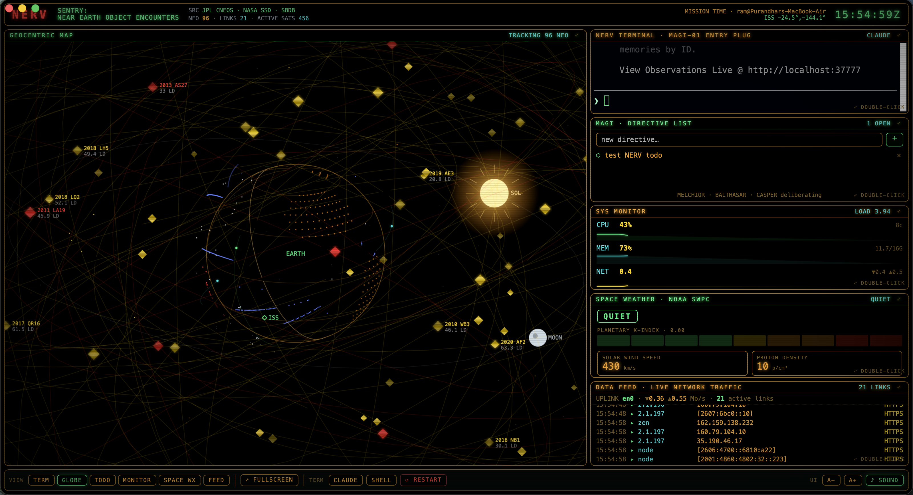

<div align="center">

# ◈ NEON GENESIS TERMINAL

### A live, Evangelion / NERV-themed mission console for macOS — your terminal, wrapped in a geocentric near-earth-object tracker.

`real NASA asteroid data` · `1,300+ live satellites` · `day/night earth` · `space weather` · `embedded Claude Code`



</div>

---

## What is this?

**NEON GENESIS TERMINAL** is a native macOS app that turns your dev terminal into a NERV-style command deck. A Swift `WKWebView` wraps a self-contained dashboard: on the left, your real terminal (Claude Code or a plain shell); around it, live panels driven by *actual* data — near-earth asteroids from NASA, the orbiting satellite catalog from Celestrak, space weather from NOAA, and your own machine's vitals.

It's inspired by the "SENTRY: Near Earth Object Encounters" geocentric displays — rebuilt as something you can actually live in while you code.

> **Everything on screen is real.** The asteroids are tonight's real close approaches. The satellites are propagated from real orbital elements. The day/night terminator tracks the real solar declination. The network feed is your real traffic.

---

## Features

### ☄ Geocentric near-earth map (Canvas 2D, real 3D math)
- **Real asteroids** — live close-approach data from NASA NeoWs, each with its own Keplerian orbit, miss distance in lunar distances (LD), diameter, and velocity. Potentially-hazardous objects glow red.
- **1,300+ real satellites** — Starlink, GPS, OneWeb, Galileo, GLONASS, weather & GEO birds, fetched as TLEs from Celestrak and propagated client-side (Kepler solve per frame). Colored by constellation, hover to identify.
- **Live ISS** — true position from the open-notify feed, on its real ground track.
- **Day / night Earth** — a real solar-declination terminator sweeps the globe; the lit hemisphere glows amber, the night side dims to blue with city lights.
- **The Sun & Moon** — `SOL` rendered at its true declination with corona + rays; the Moon on a compressed orbit.
- Drag to orbit, scroll to zoom, hover anything for a NERV-style readout.



### 🛰 Space weather (NOAA SWPC)
Planetary K-index gauge, solar-wind speed & proton density, IMF Bz, geomagnetic storm level (QUIET → SEVERE), and an aurora-likelihood alert — straight from DSCOVR/ACE.

### 🖥 Embedded terminal
A real `ttyd` terminal in the main panel running **Claude Code** by default, with a one-click toggle to a plain shell. The whole thing is a terminal you happen to be flying.

### 📊 System monitor & network feed
btop-style CPU/MEM/NET/disk graphs, a live per-process bandwidth meter (iftop-style), and a streaming log of every outbound network connection your machine makes.

### ✦ Mission extras
- **MAGI directive list** — a persistent to-do panel (MELCHIOR · BALTHASAR · CASPER).
- **Cinematic boot sequence** — a skippable NERV/MAGI bring-up on launch.
- **Web-Audio sound design** — subtle UI blips and alarms (no per-event process spawning; one `AudioContext`).
- **Amber-phosphor CRT theme** with scanlines and vignette.

---

## Quick start

```bash
# 1. clone
git clone https://github.com/Tasty-Ramen2010/neon-genesis-terminal.git
cd neon-genesis-terminal

# 2. install (builds NERV.app, installs the dashboard, prompts for a NASA key)
./install.sh

# 3. launch
open /Applications/NERV.app
```

That's it. Double-click any panel to make it the main view; click `⤢` for fullscreen.

### Dependencies
The installer checks for these and tells you how to get any you're missing:

| Tool | Why | Install |
|------|-----|---------|
| `python3` | stdlib-only backend (data sampler + HTTP) | preinstalled / `brew install python3` |
| `ttyd`    | the embedded terminal | `brew install ttyd` |
| Xcode CLT | `swiftc` to build the native app | `xcode-select --install` |

Prefer no app? Run **`nerv-dash`** to start the services and open the console in your browser instead.

---

## 🔑 NASA API key (bring your own)

The asteroid feed uses NASA's free [NeoWs](https://api.nasa.gov) API. **Get your own key — it takes about 30 seconds at [api.nasa.gov](https://api.nasa.gov)** (no email confirmation). The installer will ask for it and save it to `~/.config/nerv-theme/config.json`, which is **gitignored** — your key never leaves your machine.

Resolution order: `NASA_API_KEY` env var → `~/.config/nerv-theme/config.json` → NASA's shared `DEMO_KEY`. `DEMO_KEY` works out of the box but is heavily rate-limited, so the asteroid panel may go quiet under load — that's why your own (still free) key is worth the 30 seconds.

```jsonc
// ~/.config/nerv-theme/config.json   (created by the installer; never committed)
{ "nasa_api_key": "your-free-key-here" }
```

---

## Architecture

```
NERV.app (Swift WKWebView, opens maximized)
        │  loads
        ▼
http://127.0.0.1:8731/  ──  nerv-server.py  (Python stdlib only)
        │                     • one background sampler thread caches all stats
        │                     • HTTP handlers only read the cache (polling never blocks)
        │                     • fetches: NASA NeoWs · Celestrak TLE · NOAA SWPC · open-notify ISS
        ▼
nerv-dashboard.html  (vanilla JS + Canvas 2D, one self-contained file)
        │  embeds
        ▼
ttyd :7682 (Claude)   +   ttyd :7683 (shell)   as <iframe>s
```

- **`nerv-dash`** — the launcher: `serve`, `stop`, `restart-term`, `status`, `kill`, …
- **`nerv-server.py`** — backend. All external fetches happen on a timer in one thread and are cached; the render loop and HTTP polling never trigger per-request work.
- **`nerv-dashboard.html`** — the entire frontend. Panels swap via CSS grid-area reassignment, so the terminal iframe never reloads when you rearrange the deck.
- The render loop throttles to ~30fps and pauses entirely when the window is hidden.

---

## Controls

| Action | How |
|--------|-----|
| Make a panel the main view | double-click it, or use the `VIEW` bar |
| Fullscreen a panel | `⤢` button / double-click its title / `Esc` to exit |
| Orbit / zoom the globe | drag / scroll (when it's the main view) |
| Identify an object | hover it |
| Toggle Claude ↔ shell | `CLAUDE` / `SHELL` in the bar |
| Mute sound | `♪ SOUND` |
| Skip the boot sequence | click / any key |

---

## Credits & data sources

- **NASA NeoWs / JPL CNEOS / SBDB** — near-earth-object close approaches.
- **[Celestrak](https://celestrak.org)** (Dr. T.S. Kelso) — satellite TLE catalog.
- **[NOAA SWPC](https://www.swpc.noaa.gov)** — space-weather (K-index, solar wind, IMF).
- **[open-notify](http://open-notify.org)** — live ISS position.
- Visual concept inspired by the geocentric "SENTRY" near-earth-object displays.
- *Neon Genesis Evangelion* and NERV are the inspiration for the aesthetic only; this project is an unaffiliated fan homage.

---

## Roadmap

- [ ] Optional MAGI multi-agent deliberation vote on directives
- [ ] Configurable panel presets / saved layouts
- [ ] Linux build (the dashboard is portable; only the native shell is macOS-specific)
- [ ] More constellations & launch-window overlays

---

## License

[MIT](LICENSE) — do whatever you like; attribution appreciated.

<div align="center"><sub>ALL SYSTEMS NOMINAL · ENTER GEOFRONT</sub></div>
